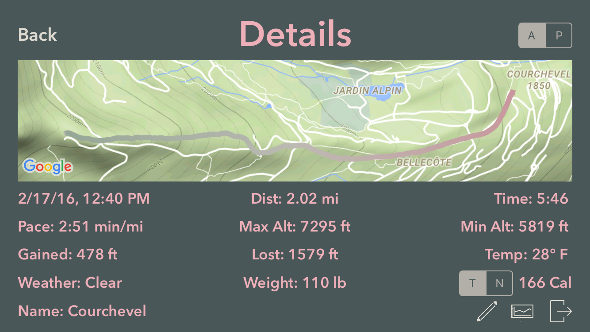
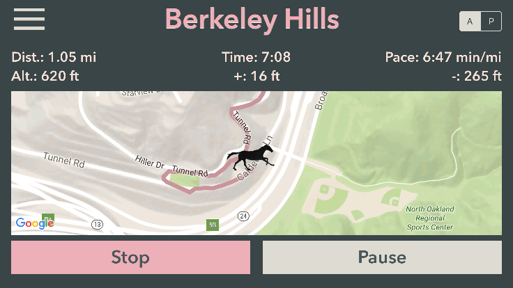

[](http://twitter.com/vermont42)
[]()
[](https://twitter.com/vermont42/status/784504585243078656)

RaceRunner
===================

**RaceRunner** is a run-tracking iPhone app focused on racing. Spectators can track the progress of runners during races. Spectators can start and stop timing of runs. Spectators can send messages to runners which are read aloud by the runner's phone. The app can stop timing a run automatically after a certain distance, which is useful for the time trials that runners conduct in preparation for races. The app can track shoe mileage and warn the user when mileage limits are exceeded.

I released **RaceRunner** to the [App Store](https://itunes.apple.com/us/app/racerunner-run-tracking-app/id1065017082) on April 21, 2016. Since then, a Chinese open-source-app website, [iOSCodeHub](http://www.ioscodehub.com/2016/06/06/开源app推荐-racerunner-跑步跟踪记录app/), featured **RaceRunner**!

The full source code for **RaceRunner** is here on GitHub for two reasons. First, open source seems appropriate in light of **RaceRunner**'s open-source [heritage](https://github.com/mluedke2/moonrunner). Second, I wish to advance the state of the art in run-tracking apps.

If you would like to build **RaceRunner** for yourself, follow these four easy steps:

1. Clone the repo.
2. Type `pod install` from the root of **RaceRunner** in Terminal.
3. Add API keys for Google Maps, Dark Sky, Open Weather, and PubNub to `Config.swift`.
4. Modify `UIView+Bezier.swift`, which is in the **COBezierTableView** CocoaPod, as shown below.

```swift
    public struct BezierPoints {
        static var p1 = CGPoint(x: -128, y: 0)
        static var p2 = CGPoint(x: 260, y: 374)
        static var p3 = CGPoint(x: -250, y: 168)
        static var p4 = CGPoint(x: 5, y: 480)
    }
```

### Run in Progress

Colors of the route indicate altitude changes.


### Run Details

Colors of the route indicate pace changes.


### Run Details

App looks great in landscape mode.


### Graph of Pace and Altitude


### Settings


### Spectating a Race in Germany from California


### Spectating a Walk in Vermont from California


### A Ski Run in the French Alps



### Shoes


### Horse IAP

User can unlock animated-horse IAP.




### Main Menu


### Chromatic Inspiration

