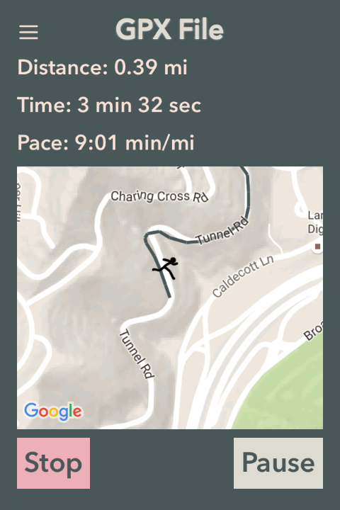
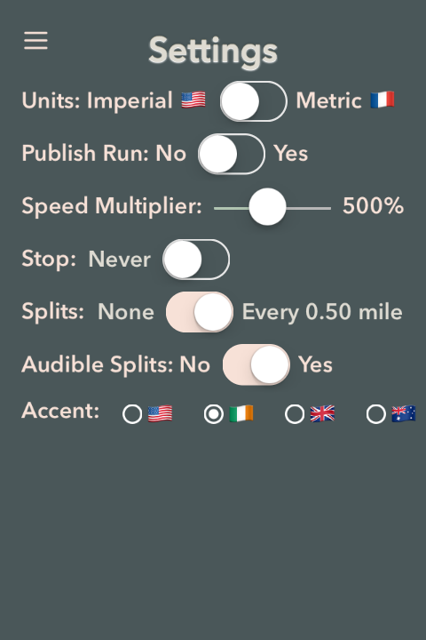
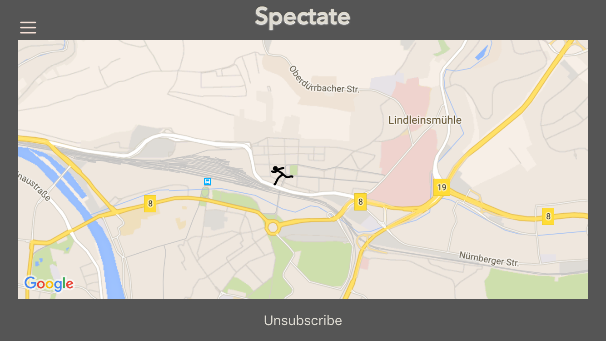
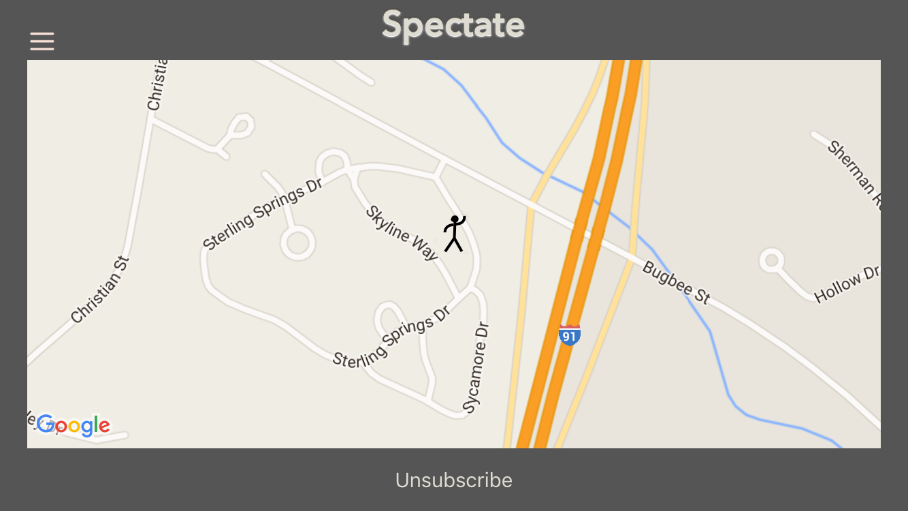
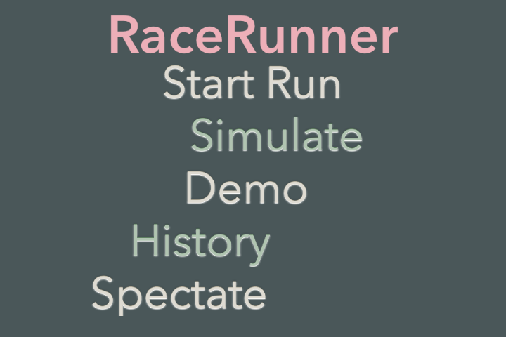

RaceRunner
===================

**RaceRunner** is a run-tracking app I am developing in the open. There are many run-tracking apps in the App Store, but **RaceRunner** is distinguished by several features focused on racing. Spectators can track the progress of runners during races. Spectators will be able to start and stop timing of runs. The app can stop timing a run automatically after a certain distance. (This is actually useful for time trials.)

Because **RaceRunner** is under development, refactoring will occur.

**RaceRunner** requires API keys for Google Maps, Dark Sky, and PubNub in `Config.swift`.

###Run in Progress

Colors of the route indicate altitude changes.

###Run Details

Colors of the route indicate pace changes.

###Settings

###Spectating a Race in Germany from California

###Spectating a Walk in Vermont from California

###Main Menu

##Chromatic Inspiration

