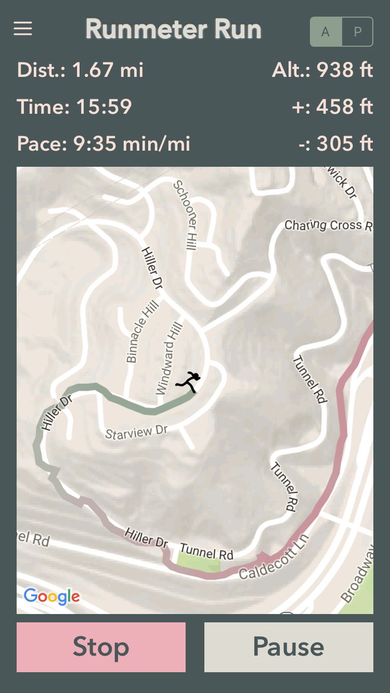
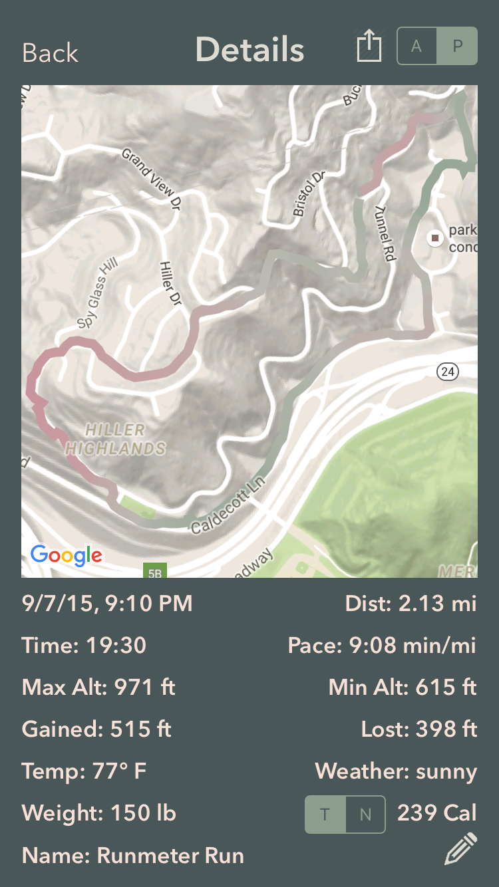
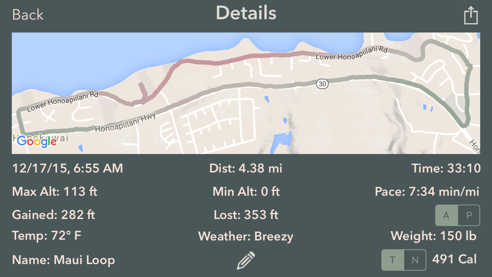
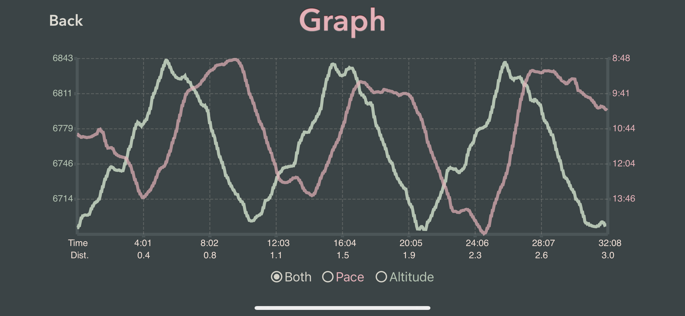
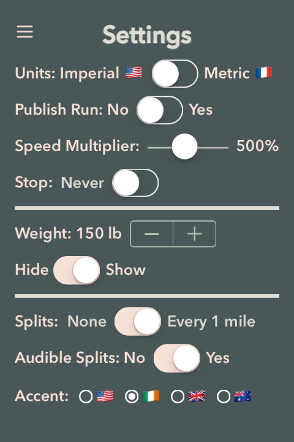
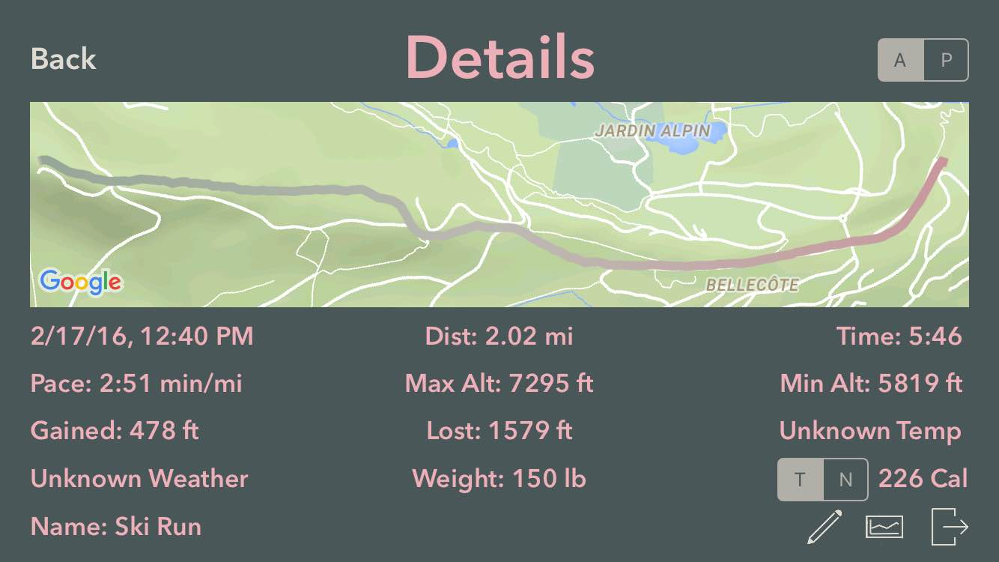
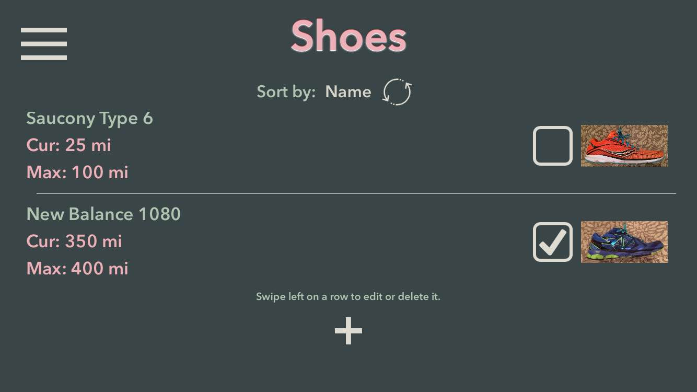
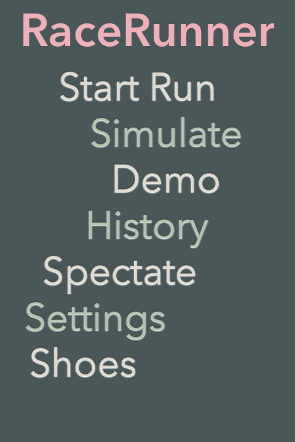

RaceRunner
===================

**RaceRunner** is a run-tracking app I am developing in the open. There are many run-tracking apps in the App Store, but **RaceRunner** is distinguished by features focused on racing. Spectators can track the progress of runners during races. Spectators will be able to start and stop timing of runs. The app can stop timing a run automatically after a certain distance, which is useful for time trials. The app can track shoe mileage and warn the user when mileage limits are exceeded.

Because **RaceRunner** is under development, refactoring will occur.

**RaceRunner** requires API keys for Google Maps, Dark Sky, and PubNub in `Config.swift`.

If you would like to build **RaceRunner** for yourself, follow these three easy steps.

1. Clone the repo.
2. Add API keys for Google Maps, Dark Sky, and PubNub to `Config.swift`.
3. Modify `UIView+Bezier.swift`, which is in the **COBezierTableView** Cocoapod, as follows and then build **RaceRunner**.
```swift
    public struct BezierPoints {
        static var p1 = CGPoint(x: -128, y: 0)
        static var p2 = CGPoint(x: 260, y: 374)
        static var p3 = CGPoint(x: -250, y: 168)
        static var p4 = CGPoint(x: 5, y: 480)
    }
```

###Run in Progress

Colors of the route indicate altitude changes.




###Run Details

Colors of the route indicate pace changes.




###Run Details

App looks great in landscape mode.




###Graph of Pace and Altitude



###Settings



###Spectating a Race in Germany from California


###Spectating a Walk in Vermont from California


###Skiing the French Alps


###Shoes



###Main Menu



##Chromatic Inspiration

